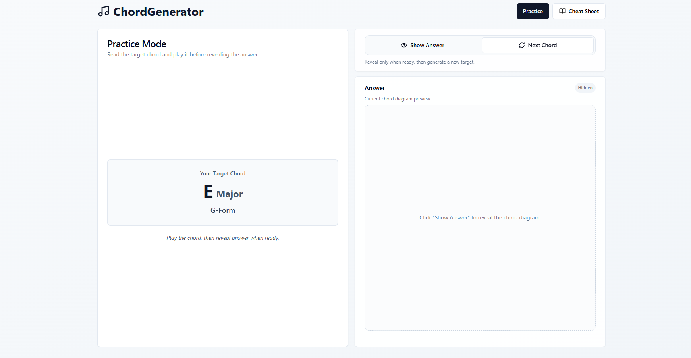
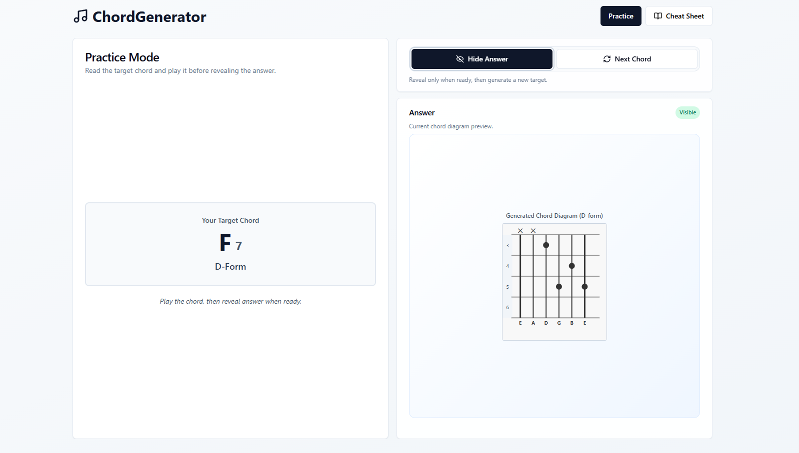
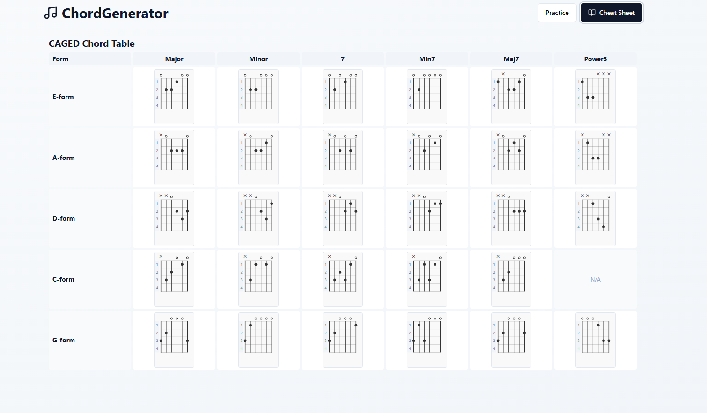

# ChordGenerator

Simple static frontend app that will help me learn and memorize guitar chords.

Guitar chords are composed of three parts:

- Root note (e.g. C, A, D)
- Chord type (e.g. Major, Minor, Major7)
- CAGED form (e.g. E form, A form, G form)

This app will generate a random chord by randomizing these 3 parts, and the user can practice
figuring out the chord. There's also a "Show Answer" button and also a Cheat Sheet page.

## App Snippets

### Random Chord Generator



### Random Chord Generator with Answer



### Cheat Sheet



## Run Locally

```bash
npm install
npm run dev
```

## Build

```bash
npm run build
```
